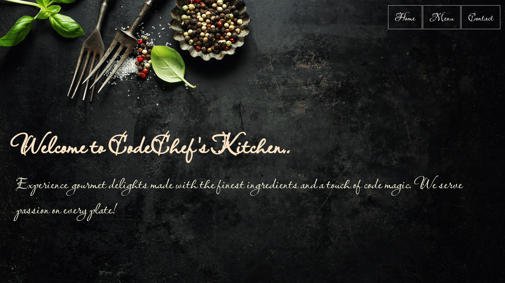

# 🍽️ Restaurant Page

A single-page restaurant website built using **vanilla JavaScript** and **Webpack**. All content is dynamically rendered through JavaScript — including tab navigation — with no hardcoded page content. This project serves as a practice assignment to explore modular JS, Webpack configuration, and Single Page Application (SPA) architecture.


---

## 🌐 Live Demo

🔗 [Visit Live Site](https://aryan-restaurant-page.netlify.app)

---

## 🖼️ Preview



---

## 📦 Tech Stack

- **JavaScript (ES6 Modules)**
- **HTML5**
- **CSS3**
- **Webpack**  
  → `webpack-dev-server`, `HtmlWebpackPlugin`, `asset modules`

---

## 🚀 Features Implemented

- ⚙️ Webpack setup with build and dev server
- 🔗 Modular JS structure (`home`, `menu`, `contact`)
- 🧠 SPA-style dynamic tab switching via DOM manipulation
- 🎨 Background image and Google Fonts
- 🖼️ Favicon and clean UI setup
- 🌍 Deployed to Netlify

---

## 📁 Folder Structure

```
restaurant-page/
├── dist/                       # Webpack output (auto-generated)
├── src/
│ ├── assets/                   # Static assets (background, favicon, etc.)
│ ├── modules/                  # JS modules for each tab
│ ├── index.js                  # Entry point
│ ├── style.css                 # Main styling
│ └── template.html             # HTML base (injected via HtmlWebpackPlugin)
├── .gitignore
├── package.json
├── webpack.config.js
└── README.md
```

---

## 🛠️ Getting Started

### Clone the repository:

```bash
git clone https://github.com/singharyan006/restaurant-page.git
cd restaurant-page
```

---

## Install dependencies:

```bash
npm install 
```

---

## Run in development:

```bash
npm start
```

---

## Build for production:

```bash
npm run build
```

---

## 🏷️ Version
- [v1.0.0 — Initial release](https://github.com/singharyan006/restaurant-page/releases/tag/v1.0)

---

## 📌 Future Enhancements
- Improve mobile responsiveness and layout.
- Add animations/transitions between tab switches.
- Add form functionality for Contact section.
- Replace dummy content with real menu data.

---

## LICENSE
📎 [LICENSE](LICENSE)